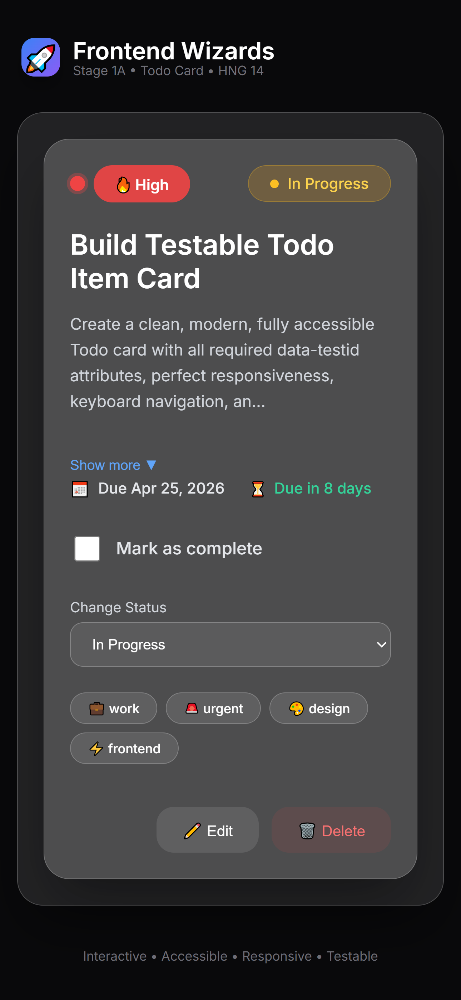

# Frontend Wizards — Stage 1A: Advanced Interactive Todo Card

An enhanced, stateful, and fully interactive Todo Card built as part of the Frontend Wizards Stage 1A task. This is an upgrade from the Stage 0 version with editing capabilities, dynamic status management, and improved UX.

<p align="center">
  
</p>

## 🚀 What Changed from Stage 0 to Stage 1A

This is a significant upgrade from the basic Stage 0 Todo Card:

- **Full Edit Mode** — Users can now edit title, description, priority, and due date directly in the card
- **Status Management** — Added a dedicated status dropdown that syncs with the checkbox
- **Priority Indicator** — Dynamic colored dot that changes based on Low/Medium/High
- **Expand/Collapse Description** — Long descriptions can now be toggled with proper ARIA support
- **Advanced Time Logic** — More granular time remaining ("Due in 45 minutes", "Overdue by 2 hours", etc.)
- **Overdue Visual Warning** — Clear red indicator when task is overdue
- **Smart "Done" State** — When marked done, time updates stop and show "Completed"
- **Better State Management** — All changes are now properly tracked in memory
- **Improved Accessibility** — Better focus management and ARIA attributes

All Stage 0 requirements (data-testid, responsiveness, basic accessibility) are still fully supported.

## ✅ New Features Added in Stage 1A

- Full **Edit Mode** with form (Title, Description, Priority, Due Date)
- **Status Control** dropdown with synchronization to checkbox
- **Priority Indicator** with colored dot that updates dynamically
- **Expand/Collapse** for long descriptions (with proper ARIA attributes)
- Granular **Time Remaining** logic ("Due in 45 minutes", "Overdue by 2 hours", etc.)
- **Overdue Indicator** with visual warning
- When status is "Done":
  - Title gets strikethrough
  - Time remaining changes to "Completed"
  - Updates stop
- All Stage 0 features preserved

## 🧪 Testability (All data-testid)

**Stage 0 + New Stage 1A IDs:**

- `test-todo-card`
- `test-todo-title`, `test-todo-description`, `test-todo-priority`
- `test-todo-due-date`, `test-todo-time-remaining`, `test-todo-status`
- `test-todo-complete-toggle`, `test-todo-tags`
- `test-todo-edit-button`, `test-todo-delete-button`
- `test-todo-edit-form`
- `test-todo-edit-title-input`, `test-todo-edit-description-input`
- `test-todo-edit-priority-select`, `test-todo-edit-due-date-input`
- `test-todo-save-button`, `test-todo-cancel-button`
- `test-todo-status-control`
- `test-todo-priority-indicator`
- `test-todo-expand-toggle`, `test-todo-collapsible-section`
- `test-todo-overdue-indicator`

## 🚀 Live Demo

[View Live Demo](https://frontend-wizards-todo-card.vercel.app/)

## 🛠️ Technologies Used

- HTML5 (Semantic)
- Tradition CSS
- Vanilla JavaScript (with proper state managment)
- Responsive design with mobile-first approach

## 📱 Responsiveness

- Fully responsive from **320px** (mobile) to **1200px** (desktop)
  -Edit form fields stack vertically on small screens
- Tags wrap nicely on small screens
- No layout overflow

## ♿ Accessibility Highlights

- Proper `<label for="">` on all form fields
- `aria-expanded` and `aria-controls` on expand toggle
- Keyboard navigation maintained (Checkbox → Status → Expand → Edit → Delete)
- Visible focus styles
- WCAG AA compliant contrast
- Semantic HTML throughout

## 📂 Project Structure

frontend-wizards-todo-card/

├── index.html

├── style.css

├── main.js

└── README.md

## 🧩 Key Behaviours

- **Edit Mode**: Click Edit → Modify content → Save or Cancel
- **Status Sync**: Checkbox and Status dropdown stay in sync
- **Priority**: Visual colored indicator updates live
- **Time Logic**: Updates every 30 seconds with detailed text + overdue warning
- **Done State**: Title strikethrough + "Completed" text + stops time updates

## ✅ How to Run Locally

1. Clone the repository:

   ```bash
   git clone https://github.com/OladokunLT/frontend-wizards-todo-card.git

   ```

2. Open index.html in your browser.

## Submission Details

- **Task:** Frontend Wizards Stage 1A (Advanced Todo Card)

- **Deadline:** April 17, 2026

- **Live URL:** https://frontend-wizards-todo-card.vercel.app/

- **GitHub Repo:** https://github.com/OladokunLT/frontend-wizards-todo-card

---

Built with ❤️ for Frontend Wizards
